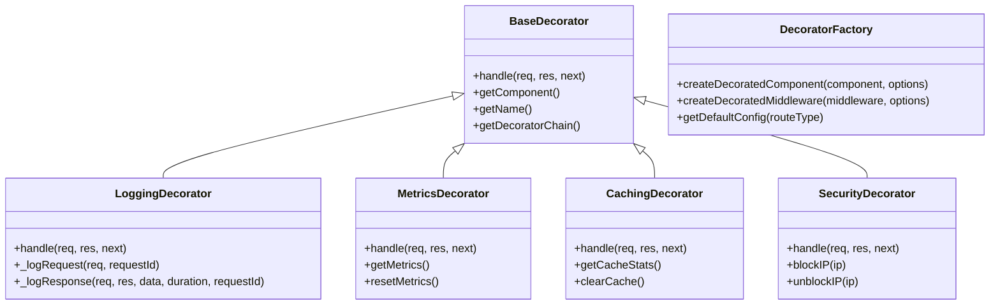

# 🎨 Decorator Pattern - Implementación en API Gateway

## 📋 Resumen Ejecutivo

Este documento describe la implementación del **Decorator Pattern** en el API Gateway del Sistema de Gestión Universitaria (SGU), permitiendo agregar funcionalidades adicionales de forma dinámica y modular.

## 🎯 Objetivos

- **Flexibilidad**: Agregar funcionalidades sin modificar código existente
- **Modularidad**: Separar responsabilidades en decoradores específicos
- **Reutilización**: Aplicar decoradores a diferentes componentes
- **Configurabilidad**: Personalizar comportamiento por tipo de ruta

## 🏗️ Arquitectura del Decorator Pattern

### Estructura de Archivos

```
api-gateway/src/decorators/
├── BaseDecorator.js           # Clase base abstracta
├── LoggingDecorator.js        # Decorador de logging
├── MetricsDecorator.js        # Decorador de métricas
├── CachingDecorator.js        # Decorador de cache
├── SecurityDecorator.js       # Decorador de seguridad
└── DecoratorFactory.js        # Factory para crear decoradores
```

### Diagrama de Clases



## 🔧 Implementación

### 1. BaseDecorator (Clase Abstracta)

```javascript
class BaseDecorator {
  constructor(component) {
    if (!component) {
      throw new Error("BaseDecorator requires a component to decorate");
    }
    this._component = component;
  }

  handle(req, res, next) {
    return this._component.handle(req, res, next);
  }

  getComponent() {
    return this._component;
  }
  getName() {
    return this.constructor.name;
  }
  getDecoratorChain() {
    /* ... */
  }
}
```

### 2. LoggingDecorator

**Funcionalidades**:

- Logging detallado de requests y responses
- Diferentes niveles de log (info, warn, error)
- Inclusión opcional de headers y body
- Medición de tiempo de respuesta

**Configuración**:

```javascript
{
  logLevel: 'info',
  includeHeaders: false,
  includeBody: false,
  logResponse: true
}
```

### 3. MetricsDecorator

**Funcionalidades**:

- Recolección de métricas de performance
- Estadísticas de status codes
- Análisis de User Agents e IPs
- Cálculo de tasas de error

**Métricas Recolectadas**:

- Total de requests
- Tiempo promedio de respuesta
- Distribución de status codes
- Tasa de error

### 4. CachingDecorator

**Funcionalidades**:

- Cache en memoria para responses
- TTL configurable
- Límite de tamaño
- Generación de claves personalizable

**Configuración**:

```javascript
{
  ttl: 300000,        // 5 minutos
  maxSize: 100,       // 100 entradas
  cacheKeyGenerator: (req) => `${req.method}:${req.url}`,
  shouldCache: (req) => req.method === 'GET'
}
```

### 5. SecurityDecorator

**Funcionalidades**:

- Validación de requests
- Detección de patrones sospechosos
- Bloqueo de IPs
- Headers de seguridad

**Medidas de Seguridad**:

- Validación de tamaño de request
- Detección de SQL injection
- Headers CORS y Helmet
- Logging de eventos de seguridad

## 🏭 DecoratorFactory

### Creación de Componentes Decorados

```javascript
// Crear componente con decoradores
const decorated = DecoratorFactory.createDecoratedComponent(component, {
  decorators: [
    { type: "logging", config: { logLevel: "info" } },
    { type: "metrics", config: { collectResponseTime: true } },
    { type: "security", config: { enableRequestValidation: true } },
  ],
});
```

### Configuraciones por Defecto

```javascript
// Configuración para diferentes tipos de rutas
const authConfig = DecoratorFactory.getDefaultConfig("auth");
const coursesConfig = DecoratorFactory.getDefaultConfig("courses");
const paymentsConfig = DecoratorFactory.getDefaultConfig("payments");
```

## 🎯 Casos de Uso

### 1. Middleware de Logging

```javascript
const loggingMiddleware = DecoratorFactory.createDecoratedMiddleware(
  originalMiddleware,
  {
    decorators: [{ type: "logging", config: { logLevel: "debug" } }],
  }
);
```

### 2. Proxy con Cache

```javascript
const cachedProxy = DecoratorFactory.createDecoratedProxy(proxyConfig, {
  decorators: [
    { type: "caching", config: { ttl: 300000 } },
    { type: "metrics", config: { collectResponseTime: true } },
  ],
});
```

### 3. Ruta con Seguridad

```javascript
const secureRoute = DecoratorFactory.createDecoratedComponent(routeHandler, {
  decorators: [
    { type: "security", config: { enableRequestValidation: true } },
    { type: "logging", config: { includeHeaders: true } },
  ],
});
```

## 📊 Beneficios del Decorator Pattern

### ✅ Ventajas

1. **Flexibilidad**: Agregar funcionalidades sin modificar código existente
2. **Modularidad**: Cada decorador tiene una responsabilidad específica
3. **Reutilización**: Aplicar los mismos decoradores a diferentes componentes
4. **Configurabilidad**: Personalizar comportamiento por tipo de ruta
5. **Testabilidad**: Probar decoradores de forma independiente

### ⚠️ Consideraciones

1. **Complejidad**: Puede aumentar la complejidad del código
2. **Performance**: Cada decorador añade overhead
3. **Debugging**: Puede ser difícil debuggear cadenas largas de decoradores
4. **Orden**: El orden de los decoradores puede afectar el comportamiento

## 🧪 Testing

### Tests Unitarios

```javascript
describe("LoggingDecorator", () => {
  test("debe loggear request y response", () => {
    const decorator = new LoggingDecorator(mockComponent);
    decorator.handle(mockReq, mockRes, mockNext);
    // Verificar logging
  });
});
```

### Tests de Integración

```javascript
describe('DecoratorFactory', () => {
  test('debe crear componente con múltiples decoradores', () => {
    const decorated = DecoratorFactory.createDecoratedComponent(
      component,
      { decorators: [...] }
    );
    // Verificar cadena de decoradores
  });
});
```

## 📈 Métricas y Monitoreo

### Métricas Disponibles

- **Requests**: Total de requests procesadas
- **Response Time**: Tiempo promedio de respuesta
- **Error Rate**: Tasa de errores
- **Cache Hit Rate**: Tasa de aciertos en cache
- **Security Events**: Eventos de seguridad

### Dashboard de Métricas

```javascript
// Obtener métricas de un decorador
const metrics = metricsDecorator.getMetrics();
const cacheStats = cachingDecorator.getCacheStats();
```

## 🔄 Flujo de Trabajo

### 1. Request Entrante

```
Request → LoggingDecorator → MetricsDecorator → CachingDecorator → SecurityDecorator → Component
```

### 2. Response Saliente

```
Component → SecurityDecorator → CachingDecorator → MetricsDecorator → LoggingDecorator → Response
```

## 🚀 Próximos Pasos

1. **Implementar en API Gateway**: Aplicar decoradores a rutas existentes
2. **Métricas Avanzadas**: Integrar con Prometheus/Grafana
3. **Cache Distribuido**: Migrar a Redis para cache distribuido
4. **Decoradores Personalizados**: Crear decoradores específicos del dominio
5. **Testing E2E**: Tests de integración con decoradores

## 📚 Referencias

- [Decorator Pattern - Design Patterns](https://refactoring.guru/design-patterns/decorator)
- [Express.js Middleware](https://expressjs.com/en/guide/using-middleware.html)
- [Node.js Performance Best Practices](https://nodejs.org/en/docs/guides/simple-profiling/)

## 🎯 Conclusión

El Decorator Pattern implementado en el API Gateway proporciona una solución elegante y flexible para agregar funcionalidades transversales como logging, métricas, caching y seguridad, manteniendo el código modular y reutilizable.
